```mermaid
sequenceDiagram
    actor U as User
    participant B as Browser
    participant S as Server
    participant DB as Datenbank
    participant RT as Echtzeit-Updates

    %% ─── RAUM ERSTELLEN ───────────────────────────────────────────
    rect rgb(20, 50, 80)
    Note over U,RT: RAUM ERSTELLEN (Host)
    U->>B: Klick "Raum erstellen"
    B->>B: Singleplayer-Namen zwischenspeichern
    B->>S: Raum anlegen
    S->>DB: Raum-Datensatz anlegen
    S-->>B: Raum-Key + Mitspielerliste [Host]
    B->>B: UI auf Raum-Modus umschalten
    Note right of B: Erstellen/Beitreten ausgeblendet<br/>Raum-Info eingeblendet<br/>Drehen & Reset = Host-Modus
    B->>B: Rad-Namensliste & Mitspielerliste mit [Host] befüllen
    Note right of B: Rad-Namensliste gesperrt
    B->>RT: Echtzeit-Updates abonnieren
    end

    %% ─── RAUM BEITRETEN ───────────────────────────────────────────
    rect rgb(20, 70, 40)
    Note over U,RT: RAUM BEITRETEN (Guest)
    U->>B: Klick "Beitreten" (mit Code)
    B->>B: Singleplayer-Namen zwischenspeichern
    B->>S: Raum beitreten (mit Code)
    S->>DB: Guest zur Mitspielerliste hinzufügen
    DB-->>S: aktualisierte Mitspielerliste
    S-->>B: Mitspielerliste + Multiplikator + Hostname
    B->>B: UI auf Raum-Modus umschalten
    Note right of B: Erstellen/Beitreten ausgeblendet<br/>Raum-Info eingeblendet<br/>Drehen & Reset gesperrt (Guest)
    B->>B: Rad-Namensliste & Mitspielerliste befüllen
    B->>B: Multiplikator setzen & sperren
    B->>RT: Echtzeit-Updates abonnieren
    end

    %% ─── ECHTZEIT-UPDATES ─────────────────────────────────────────
    rect rgb(60, 20, 70)
    Note over U,RT: ECHTZEIT-UPDATES (während im Raum)
    DB-->>RT: Raum-Datensatz hat sich geändert
    RT->>B: Neue Daten empfangen
    alt Mitspielerliste geändert (nicht leer)
        B->>B: Rad-Namensliste & Mitspielerliste aktualisieren
        Note right of B: Lokal entfernte Guests<br/>kommen nicht zurück
    else Mitspielerliste leer → Host hat Raum geschlossen
        B->>B: Raum-Modus beenden
        B-->>U: Hinweis: "Der Host hat den Raum geschlossen"
        Note right of B: Nur beim Guest<br/>(Host hat bereits selbst abgemeldet)
    else Drehergebnis eingegangen
        B->>B: Rad drehen
        Note right of B: Nur beim Guest<br/>Host dreht direkt nach Serverantwort
    else Reset eingegangen
        B->>B: Rad & Modal zurücksetzen
        Note right of B: Nur beim Guest
    else Multiplikator geändert
        B->>B: Multiplikator aktualisieren
        Note right of B: Nur beim Guest
    end
    end

    %% ─── RAUM VERLASSEN ───────────────────────────────────────────
    rect rgb(80, 25, 25)
    Note over U,RT: RAUM VERLASSEN
    U->>B: Klick "Verlassen"
    alt Rad dreht noch
        B-->>U: Hinweis: "Bitte warte..."
    else Host mit aktiven Guests
        B->>U: Bestätigungs-Dialog anzeigen
        alt Abbrechen
            B->>U: Dialog schließt — kein Effekt
        else Bestätigen
            B->>B: Raum verlassen
        end
    else Host allein
        B->>B: Raum verlassen
    end
    B->>B: Echtzeit-Updates abmelden & UI zurücksetzen
    Note right of B: Zuerst abmelden, damit der Host<br/>sein eigenes Schließ-Event nicht empfängt<br/>Erstellen/Beitreten wieder eingeblendet<br/>Rad-Namensliste auf Singleplayer-Namen zurückgesetzt<br/>Rad-Namensliste entsperrt
    B->>S: Raum verlassen (mit Code)
    alt Nutzer ist Host
        S->>DB: Mitspielerliste leeren
        Note right of DB: Leere Liste signalisiert<br/>allen Guests: Raum geschlossen
        DB-->>RT: Raum-Update (Mitspielerliste leer)
        RT->>B: Guests beenden Raum-Modus
    else Nutzer ist Guest
        S->>DB: Guest aus Mitspielerliste entfernen
        DB-->>RT: Raum-Update (Guest entfernt)
        RT->>B: Alle aktualisieren ihre Mitspielerliste
    end
    B-->>U: Bestätigung: "Raum geschlossen" / "Raum verlassen"
    end
```

# Multiplayer Room Flow — IST-Zustand

Sequenzdiagramm der aktuellen Architektur hinter "Raum erstellen", "Raum beitreten" und "Raum verlassen".

---

---

## Architektonische Besonderheiten

- **Abmelden vor dem Server-Request** — beim Verlassen werden die Echtzeit-Updates zuerst abgemeldet, damit der Host sein eigenes Schließ-Event nicht empfängt.
- **Zwei Listen** — eine Mitspielerliste (alle laut Server, für Confirm-Dialog & Seitenleiste), eine Rad-Namensliste (gefiltert um lokal entfernte Guests).
- **Singleplayer-Namen** — werden beim Betreten einmalig gesichert und beim Verlassen automatisch wiederhergestellt.
- **Lokal entfernte Guests** — werden beim nächsten Echtzeit-Update nicht erneut zur Rad-Namensliste hinzugefügt.
