# Multiplayer Room Flow — SOLL-Zustand

Entwurf einer überarbeiteten Architektur mit sauberem Protokoll, explizitem Zustandsmodell und ohne temporale Kopplung.

---

## Umsetzungsstatus

| # | Verbesserung | Status | Anmerkung |
|---|---|---|---|
| 1 | Raum-Datensatz beim Schließen löschen | ❌ offen | Noch `clearRoomPlayers` statt `deleteRoom` |
| 2 | DELETE-Event statt `players = []`-Hack | ❌ offen | Guests prüfen noch `players.length === 0` |
| 3 | Keine temporale Kopplung beim Verlassen | ✅ umgesetzt | Über `if (!activeRoomKey) return;` Guard in `syncRoomPlayers` statt `isLeaving`-Flag — gleiches Ergebnis, einfacherer Ansatz |
| 4 | Zustand als `RoomSession`-Objekt | ❌ offen | Noch 7+ Einzelvariablen |
| 5 | `clearRoom()` aufteilen | ❌ offen | Noch eine God-Function |
| 6 | `hostLeaveRoom()` / `guestLeaveRoom()` | ❌ offen | Noch `executeLeaveRoom()` mit `wasHost`-Flag |
| — | Server: Auto-Leave bei stale Raum | ✅ umgesetzt | `getActiveRoomForUser` in `createRoom`/`joinRoom` — nicht ursprünglich geplant, aber nötig |
| — | `savedNames`-Guard | ✅ umgesetzt | `if (!activeRoomKey) savedNames = getNames()` — sichert gegen DOM-Manipulation |
| — | Create/Join-Buttons immer sichtbar | ✅ umgesetzt | `roomControls` wird nicht mehr ausgeblendet, da der Bug jetzt serverseitig abgesichert ist |

---

## Architekturelle Verbesserungen

### 1 — Raum-Datensatz wird beim Schließen gelöscht (statt geleert)

**IST:** Host verlässt → `players = []` als Signal → Datensatz bleibt ewig in der DB  
**SOLL:** Host verlässt → Datensatz wird gelöscht → saubere DB, keine Datenmüll-Akkumulation

### 2 — DELETE-Event ersetzt den `players = []`-Hack

**IST:** Guests prüfen im UPDATE-Handler ob `players.length === 0`  
**SOLL:** Guests abonnieren zusätzlich DELETE-Events — das ist das saubere "Raum geschlossen"-Signal

### 3 — Keine temporale Kopplung mehr beim Verlassen ✅

**IST (war):** `clearRoom()` musste zwingend *vor* dem POST kommen, damit der Host sein eigenes Event nicht empfängt  
**Umgesetzt:** `if (!activeRoomKey) return;` Guard in `syncRoomPlayers` verhindert, dass verspätete Realtime-Events nach dem Verlassen noch das Rad überschreiben  
**SOLL (ursprünglich):** `isLeaving`-Flag — dieser Ansatz ist komplexer und bleibt für Punkt 2 (DELETE-Events) relevant, wenn dieser umgesetzt wird

### 4 — Zustand als kohärentes Objekt statt Einzelvariablen

**IST:** 7+ Modulvariablen (`activeRoomKey`, `isHost`, `savedNames`, `roomPlayersList`, `removedInRoom`, …)  
**SOLL:** `RoomSession | null` — `null` bedeutet "kein Raum aktiv", Objekt enthält alles

```
RoomSession {
  key: string
  isHost: boolean
  hostName: string
  savedNames: string[]       // Singleplayer-Namen, beim Betreten gesichert
  allPlayers: string[]       // Server-Wahrheit (für Confirm-Dialog & Sidebar)
  hiddenPlayers: Set<string> // Lokal entfernte Guests (kommen nicht zurück)
}
```

### 5 — `clearRoom()` aufgeteilt in zwei Verantwortlichkeiten

**IST:** Eine God-Function macht Unsub, Zustand-Reset, UI-Reset, Namen-Restore  
**SOLL:** `exitSession()` (Zustand + Unsub) und `restoreIdleUI()` (UI) — separat aufrufbar, separat testbar

### 6 — Host- und Guest-Verlassen als getrennte, explizite Flows

**IST:** `executeLeaveRoom()` kombiniert beide Fälle mit einem `wasHost`-Flag  
**SOLL:** `hostLeaveRoom()` und `guestLeaveRoom()` — klarer Kontrollfluss, kein implizites Branching

---

## Sequenzdiagramm

```mermaid
sequenceDiagram
    actor U as User
    participant B as Browser
    participant S as Server
    participant DB as Datenbank
    participant RT as Echtzeit-Updates

    %% ─── RAUM ERSTELLEN ───────────────────────────────────────────
    rect rgb(20, 50, 80)
    Note over U,RT: RAUM ERSTELLEN (Host)
    U->>B: Klick "Raum erstellen"
    B->>B: Singleplayer-Namen in Session sichern
    B->>S: Raum anlegen
    S->>S: Prüfen ob User bereits in einem Raum (getActiveRoomForUser)
    alt User in stale Raum
        S->>DB: Alten Raum verlassen / schließen
    end
    S->>DB: Raum-Datensatz anlegen
    S-->>B: Raum-Key + Mitspielerliste [Host]
    B->>B: Session anlegen (key, isHost=true, …)
    B->>B: UI auf Raum-Modus umschalten
    B->>B: Rad-Namensliste & Mitspielerliste mit [Host] befüllen
    B->>RT: UPDATE- & DELETE-Events abonnieren
    end

    %% ─── RAUM BEITRETEN ───────────────────────────────────────────
    rect rgb(20, 70, 40)
    Note over U,RT: RAUM BEITRETEN (Guest)
    U->>B: Klick "Beitreten" (mit Code)
    B->>B: Singleplayer-Namen in Session sichern
    B->>S: Raum beitreten (mit Code)
    S->>S: Prüfen ob User bereits in einem anderen Raum
    alt User in anderem Raum
        S->>DB: Alten Raum verlassen
    end
    S->>DB: Guest zur Mitspielerliste hinzufügen
    DB-->>S: aktualisierte Mitspielerliste
    S-->>B: Mitspielerliste + Multiplikator + Hostname
    B->>B: Session anlegen (key, isHost=false, …)
    B->>B: UI auf Raum-Modus umschalten
    B->>B: Rad-Namensliste & Mitspielerliste befüllen
    B->>B: Multiplikator setzen & sperren
    B->>RT: UPDATE- & DELETE-Events abonnieren
    end

    %% ─── ECHTZEIT-UPDATES ─────────────────────────────────────────
    rect rgb(60, 20, 70)
    Note over U,RT: ECHTZEIT-UPDATES (während im Raum)
    DB-->>RT: Raum-Datensatz geändert oder gelöscht
    RT->>B: Event empfangen
    alt UPDATE: Mitspielerliste geändert
        B->>B: activeRoomKey gesetzt? → Rad & Mitspielerliste aktualisieren
        Note right of B: Guard verhindert verspätete<br/>Events nach dem Verlassen
    else UPDATE: Drehergebnis eingegangen
        B->>B: Rad drehen
        Note right of B: Nur beim Guest<br/>Host dreht direkt nach Serverantwort
    else UPDATE: Reset eingegangen
        B->>B: Rad & Modal zurücksetzen
        Note right of B: Nur beim Guest
    else UPDATE: Multiplikator geändert
        B->>B: Multiplikator aktualisieren
        Note right of B: Nur beim Guest
    else UPDATE: players = [] → Host hat Raum geschlossen (aktuell)
        B->>B: UI zurücksetzen + Namen wiederherstellen
        B-->>U: Hinweis: "Der Host hat den Raum geschlossen"
        Note right of B: Übergang zu DELETE-Event geplant (Punkt 1+2)
    end
    end

    %% ─── HOST VERLÄSST RAUM ───────────────────────────────────────
    rect rgb(80, 25, 25)
    Note over U,RT: RAUM VERLASSEN — Host
    U->>B: Klick "Verlassen"
    alt Rad dreht noch
        B-->>U: Hinweis: "Bitte warte..."
    else mit aktiven Guests
        B->>U: Bestätigungs-Dialog anzeigen
        alt Abbrechen
            B->>U: Dialog schließt — kein Effekt
        else Bestätigen
            B->>B: clearRoom() → activeRoomKey = null
            B->>S: Raum schließen
            S->>DB: Mitspielerliste leeren (→ DELETE geplant)
            DB-->>RT: UPDATE players=[] für alle Guests
            RT->>B: Guests: syncRoomPlayers-Guard greift nicht (players=[])→ UI zurücksetzen
            S-->>B: Bestätigung
            B-->>U: "Raum geschlossen"
        end
    else Host allein
        B->>B: clearRoom() → activeRoomKey = null
        B->>S: Raum schließen
        S->>DB: Mitspielerliste leeren
        S-->>B: Bestätigung
        B-->>U: "Raum geschlossen"
    end
    end

    %% ─── GUEST VERLÄSST RAUM ──────────────────────────────────────
    rect rgb(60, 40, 20)
    Note over U,RT: RAUM VERLASSEN — Guest
    U->>B: Klick "Verlassen"
    alt Rad dreht noch
        B-->>U: Hinweis: "Bitte warte..."
    else
        B->>B: clearRoom() → activeRoomKey = null + Namen wiederherstellen
        B->>S: Raum verlassen
        S->>DB: Guest aus Mitspielerliste entfernen
        DB-->>RT: UPDATE-Event (Guest entfernt)
        RT->>B: syncRoomPlayers → activeRoomKey null? → Guard greift, kein Überschreiben
        RT->>B: Andere Clients: Mitspielerliste aktualisieren
        S-->>B: Bestätigung
        B-->>U: "Raum verlassen"
    end
    end
```



---

## Offene Änderungen (noch nicht umgesetzt)

| Bereich | Was ändert sich |
|---|---|
| **Server** | `leaveRoom` (Host-Pfad): `clearRoomPlayers` → `deleteRoom` |
| **Repository** | Neue Funktion `deleteRoom(roomKey)` |
| **`room.ts`** | `subscribeToRoom` abonniert zusätzlich DELETE-Events |
| **`room.ts`** | UPDATE-Handler prüft nicht mehr `players.length === 0` |
| **`main.ts`** | `isLeaving`-Flag für sauberes Handling des eigenen DELETE-Events (Host) |
| **`main.ts`** | Zustand als `RoomSession`-Objekt (optionaler, größerer Refactor) |
| **`main.ts`** | `clearRoom()` aufgeteilt in `exitSession()` + `restoreIdleUI()` |
| **`main.ts`** | `executeLeaveRoom()` aufgeteilt in `hostLeaveRoom()` + `guestLeaveRoom()` |
