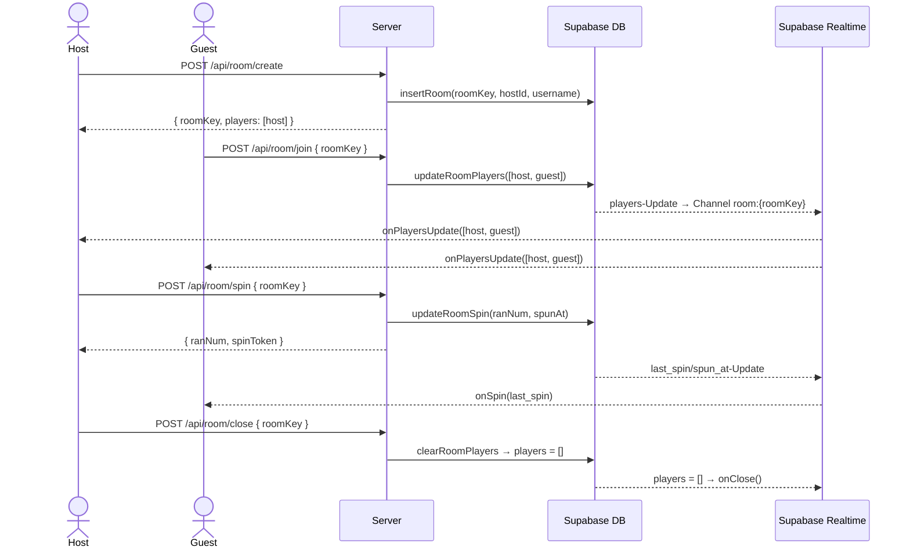

# Room-Architektur

## Konzept

Ein Room erlaubt mehreren Spielern, gemeinsam am Rad zu spielen. Der **Host** erstellt den Room und ist der einzige, der drehen darf. **Guests** treten bei und sehen das Spin-Ergebnis in Echtzeit — ohne selbst den Spin auszulösen.

---

## Rollen

| | Host | Guest |
|---|---|---|
| Spin auslösen | ✅ | ❌ |
| Spin sehen | ✅ | ✅ (via Realtime) |
| Coins erhalten | ✅ | ❌ (`spinToken` ist leer) |
| Room schließen | ✅ | ❌ |

---

## Ablauf



---

## Realtime-Sync

Clients abonnieren per Supabase Realtime einen Kanal auf der `rooms`-Tabelle:

```typescript
supabaseClient
  .channel(`room:${roomKey}`)
  .on('postgres_changes', { event: 'UPDATE', table: 'rooms', filter: `room_key=eq.${roomKey}` }, handler)
  .subscribe();
```

Ein einziges DB-Update kann mehrere Signale auslösen. Der Handler unterscheidet sie so:

| Bedingung | Signal |
|---|---|
| `players.length === 0` | Room geschlossen → `onClose()` |
| `players` hat sich geändert | Spielerliste aktualisiert → `onPlayersUpdate()` |
| `spun_at` gesetzt, Alter < 5 s | Spin-Event → `onSpin(last_spin)` |

Das 5-Sekunden-Limit verhindert, dass Guests bei Room-Beitritt einen alten Spin-Event abspielen.

---

## Room Key

```typescript
function generateRoomKey(): string {
    const chars = "ABCDEFGHIJKLMNOPQRSTUVWXYZ0123456789";
    const bytes = randomBytes(6);   // crypto — nicht Math.random
    return Array.from(bytes, (b) => chars[b % chars.length]).join("");
}
```

6 Zeichen aus 36 möglichen → 36⁶ ≈ 2,2 Mrd. Kombinationen.

---

## Spin-Flow im Vergleich

### Normaler Spin (Solo)
```
spinWheelWithRandomSteps() → POST /api/random → spinWheel(steps, dir, token, names)
```

### Host-Spin (Room)
```
handleRoomSpinClick() → POST /api/room/spin → spinWheel(steps, dir, token, names)
```

### Guest-Spin (Room)
```
onSpin(lastSpin) → spinWheel(steps, 'right', '', names)
                                              ↑
                                    kein Token → keine Coins
```

Der Guest-Spin ist rein visuell — er berechnet den Gewinner lokal anhand des vom Server übertragenen `last_spin`-Werts, ohne einen eigenen API-Call zu machen.

---

## Bekannte Einschränkungen

- Guests erhalten keine Coins (leerer `spinToken`)
- Der Room-Spin verwendet eine eigene Zufallszahl-Range im Server — aktuell noch nicht mit dem Solo-Spin-Fix abgeglichen (siehe `room-service.ts: spinRoom`)
- Nur ein aktiver Room pro User möglich (kein Multi-Room-Support)
