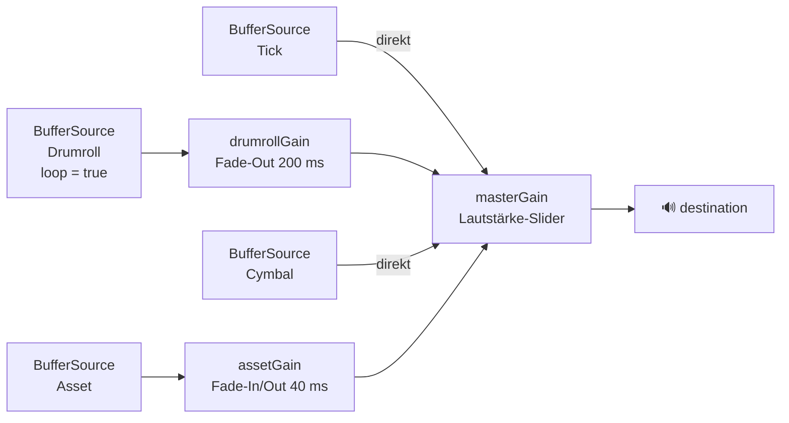
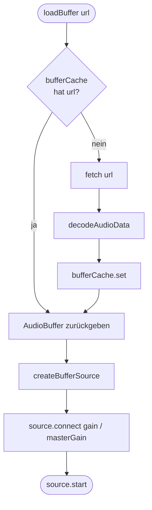

# Audio-Buffer-Architektur

## Web Audio Node-Graph

Alle Sounds laufen durch denselben `masterGain` — der Lautstärke-Slider steuert damit alles zentral.

## Buffer-Loading & Cache

`loadBuffer` wird von allen Sound-Typen genutzt. Jede URL wird nur einmal über das Netz geladen.

## Preloading

| Sound | Geladen wann | Gespeichert in |
|---|---|---|
| Tick | `preloadTickBuffer()` beim Start | `tickBuffer` |
| Drumroll | `preloadStaticSounds()` beim Start | `drumrollBuffer` |
| Cymbal | `preloadStaticSounds()` beim Start | `cymbalBuffer` |
| Asset | bei erstem `playAssetSound()` | `bufferCache` Map |
