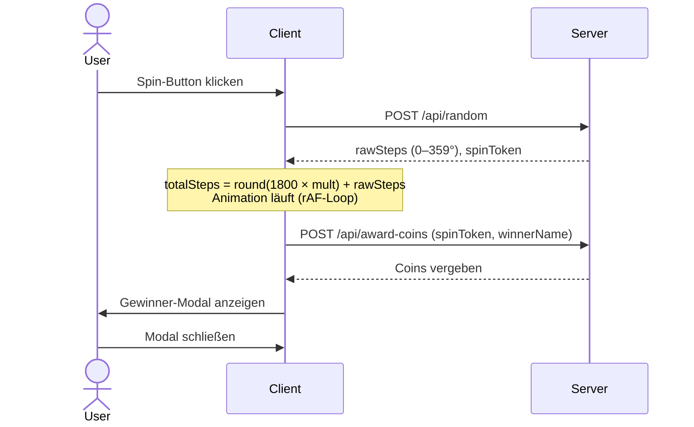

# Spin Sequenzdiagramm

```mermaid
sequenceDiagram
    actor User
    participant Client
    participant Server

    User->>Client: Spin-Button klicken
    Client->>Server: POST /api/random
    Server-->>Client: rawSteps (0–359°), spinToken

    Note over Client: totalSteps = round(1800 × mult) + rawSteps<br/>Animation läuft (rAF-Loop)

    Client->>Server: POST /api/award-coins (spinToken, winnerName)
    Server-->>Client: Coins vergeben

    Client->>User: Gewinner-Modal anzeigen
    User->>Client: Modal schließen
```
