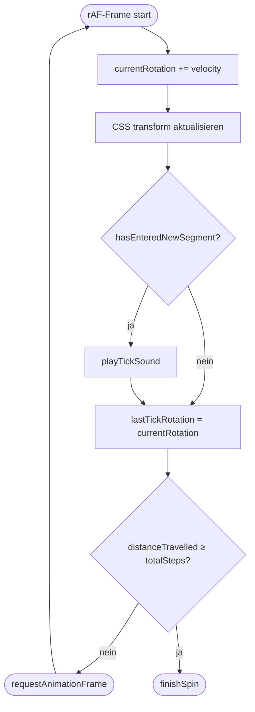

# Tick-Sound Latenz-Analyse

## Fragestellung

Ist `playTickSound()` in `runSpinFrame()` so platziert, dass kein unnötiger Delay beim Abspielen entsteht?

**Kurze Antwort: Ja — die Platzierung ist korrekt.**

## Relevanter Code

```typescript
// spin.ts: runSpinFrame()
currentRotation += velocity * state.sign;       // 1. Rotation aktualisieren
state.distanceTravelled += velocity;

updateWheelRotation();                           // 2. CSS transform setzen
if (hasEnteredNewSegment(config.stepAngle))      // 3. Segment-Übergang prüfen
  playTickSound();                               //    → Sound sofort abspielen
lastTickRotation = currentRotation;              // 4. Referenz für nächsten Frame
```

```typescript
// sound.ts: playTickSound()
source.start(ctx.currentTime);  // kein scheduled delay — sofort
```

## Reihenfolge innerhalb des Frames

| Schritt | Zeile | Warum wichtig |
|---|---|---|
| `currentRotation` aktualisieren | 104 | Tick-Check arbeitet auf dem aktuellen Frame-Zustand |
| `hasEnteredNewSegment()` prüfen | 108 | Vergleicht `lastTickRotation` (Vorframe) vs. `currentRotation` (jetzt) |
| `playTickSound()` auslösen | 108 | Feuert im selben rAF-Callback wie die visuelle Rotation |
| `lastTickRotation = currentRotation` | 109 | Steht **nach** dem Check — wäre es davor, lieferte der Check immer `false` |

## Ablauf (Flowchart)



## Unvermeidliche Latenz (~16 ms)

Der Tick wird reaktiv detektiert — maximal 1 Frame (~16 ms bei 60 fps) nach dem echten Segment-Übergang. Für einen Tick-Sound nicht wahrnehmbar.

## Edge-Case: Audio-Context-Timing

`source.start(ctx.currentTime)` kann in manchen Browsern eine stille Warning auslösen, wenn JS-Scheduling minimal hinter dem Audio-Thread hängt. Robuster wäre:

```typescript
source.start(ctx.currentTime + 0.001); // 1 ms Lookahead
```
